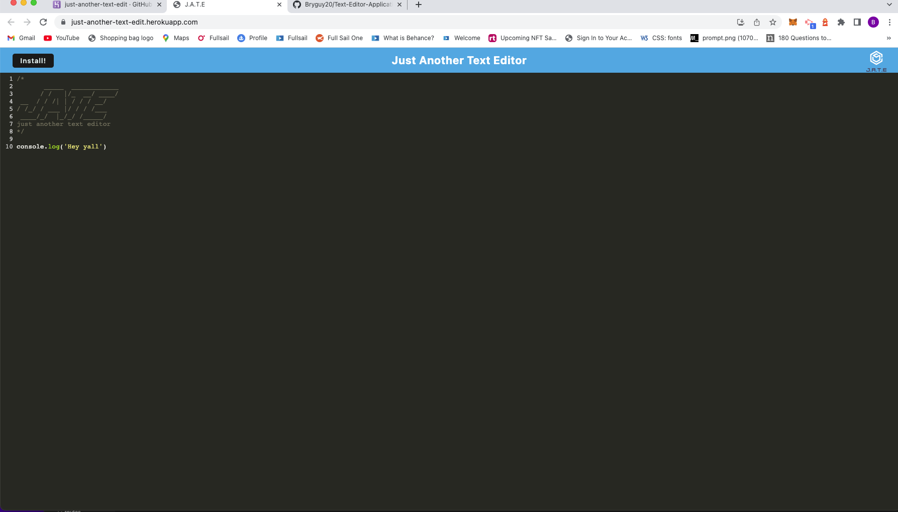

# Text-Editor-Application

  ## Table-of-Contents
  * [Description](#description)
  * [Installation](#installation)
  * [Usage](#usage)
  
    *[License](#license)
    
  * [Contributing](#contributing)
  * [Tests](#tests)
  * [Questions](#questions)
  
  ## Description
  In this project what i made just a Just Another Text-Editor or short name JATE with this application it can be used without an internet connection and this can be very usefrful as for a developer to use this tool when needed to create notes and or code snippets and it can be reliably retrieve for later use. also it can be downloaded for use on the go.

  ## [Installation](#table-of-contents)
  just need to npm intsall and all of the plugins

  ## [Usage](#table-of-contents)
  Here is a photo of the deployed application:

  
  

  ## Contributing
  
      Thank you for your interest in helping out; however, I will not be accepting contributions from third parties.
      
  ## [Tests](#table-of-contents)
  all to start is to the build which is npm run build and then after npm start to start the application. Or on the other hand you can use the deployed link: https://just-another-text-edit.herokuapp.com/

  ##  [Questions](#table-of-contents)
  Please contact me using the following links:
  [GitHub](https://github.com/bryguy20)
  [Email: bryansegarra044@gmail.com](mailto:bryansegarra044@gmail.com)
